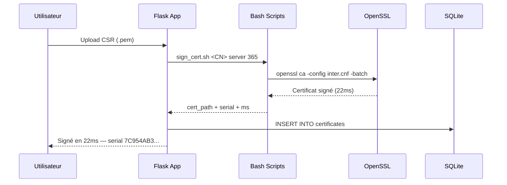

<br/>

[](https://www.python.org/)
[](https://flask.palletsprojects.com/)
[](https://www.openssl.org/)
[](https://threejs.org/)
[](https://sqlite.org/)
[](LICENSE)

<br/>

[](https://datatracker.ietf.org/doc/html/rfc5280)
[](https://csrc.nist.gov/publications/detail/sp/800-57-part-1/rev-5/final)
[](https://csrc.nist.gov/publications/detail/fips/186/4/final)
[]()
[]()
[]()
[]()
[]()
[]()

</div>

---





## 🚀 Installation en 4 étapes

<details>
<summary><b>📦 Étape 1 — Prérequis système</b></summary>

```bash
sudo apt update && sudo apt install -y openssl python3 python3-pip python3-venv git

openssl version    # OpenSSL 3.0+
python3 --version  # Python 3.10+
```

</details>

<details>
<summary><b>⬇️ Étape 2 — Cloner et configurer</b></summary>

```bash
git clone https://github.com/bilalabarkane/pki-masterpiece.git
cd pki-masterpiece

python3 -m venv venv && source venv/bin/activate
pip install flask cryptography
```

</details>

<details>
<summary><b>🔐 Étape 3 — Initialiser la PKI (Root CA + Intermediate CA)</b></summary>

```bash
bash scripts/init_ca.sh
```

Sortie attendue :
```
━━ 1/5 — Bases de données ━━
[✔] Bases de données initialisées

━━ 2/5 — Root CA (RSA 4096 · 20 ans) ━━
[✔] Clé Root générée (chmod 400)
[✔] Root CA auto-signée (20 ans)

━━ 3/5 — Intermediate CA (RSA 4096 · 10 ans) ━━
[✔] Intermediate signée par Root + chaîne créée

━━ 4/5 — CRL initiales ━━
[✔] CRL générées

━━ 5/5 — Vérification chaîne ━━
pki/intermediate/certs/inter.crt.pem: OK
[✔] Root → Intermediate : ✔ VALIDE

╔════════════════════════════════╗
║  ✅  PKI INITIALISÉE           ║
╚════════════════════════════════╝
```

</details>

<details>
<summary><b>▶️ Étape 4 — Lancer le dashboard</b></summary>

```bash
python3 run.py
```

| URL | Description |
|-----|-------------|
| `http://localhost:5000` | 📊 Tableau de bord principal |
| `http://localhost:5000/viz` | 🔮 Vue 3D Three.js interactive |
| `http://localhost:5000/generate` | 🔑 Générer une CSR |
| `http://localhost:5000/sign` | ✍️ Signer un certificat |
| `http://localhost:5000/certificates` | 📋 Gérer les certificats |
| `http://localhost:5000/verify` | ✅ Vérifier un certificat |
| `http://localhost:5000/download/crl` | 📥 Télécharger la CRL |
| `http://localhost:5000/download/chain` | 📥 Télécharger la chaîne |

</details>

---

## 🛠️ Commandes Bash complètes

```bash
# Génération clé + CSR — RSA 2048 avec SANs
bash scripts/gen_csr.sh "api.monsite.com" "www.api.monsite.com,192.168.1.1" rsa 2048

# Génération clé + CSR — ECDSA P-384 (sécurité 192 bits, post-2030)
bash scripts/gen_csr.sh "secure.app.com" "" ecdsa 384

# Signature par Intermediate CA
bash scripts/sign_cert.sh "api.monsite.com" server 365
# [✔] Signé en 22ms — Serial : 7C954AB3484AA0E4EBF42EEC6444803F946CF760

# Vérification — Score /5
bash scripts/verify.sh pki/leaf/certs/api_monsite_com.crt.pem
#   ✔ Format X.509 valide
#   ✔ Dates valides
#   ✔ Chaîne Root→Inter→Leaf valide
#   ✔ Non révoqué (CRL vérifiée)
#   ✔ Algorithme moderne (SHA-256+)
#   Score : 5/5 (100%) ✅ PARFAIT

# Révocation + mise à jour CRL
bash scripts/revoke.sh pki/leaf/certs/api_monsite_com.crt.pem keyCompromise
#   [✔] Révoqué dans index.txt
#   [✔] CRL mise à jour
#   [✔] Cert bien RÉVOQUÉ dans la CRL

# Démonstration complète automatique (6 étapes, ~8 secondes)
bash scripts/demo.sh
```

---

## 🔮 Démonstration automatique

```
  PKI MASTERPIECE — DÉMONSTRATION COMPLÈTE

╔══ 1/6 · Initialisation PKI ══╗
[✔] PKI initialisée (Root CA RSA 4096 + Inter CA + CRL)

╔══ 2/6 · Certificat RSA — api.demo.local ══╗
[✔] Clé RSA 2048 générée
[✔] CSR créée avec SAN
[✔] Signé en 22ms — Serial : 7C954AB3484AA0E4...

╔══ 3/6 · Certificat ECDSA — store.demo.local ══╗
[✔] Clé ECDSA P-384 générée (192 bits sécurité)
[✔] Signé en 22ms — Serial : 5115C41C407019F5...

╔══ 4/6 · Vérification chaînes ══╗
[✔] Score : 5/5 (100%) ✅ PARFAIT

╔══ 5/6 · Révocation api.demo.local ══╗
[✔] keyCompromise enregistré — CRL mise à jour

╔══ 6/6 · Vérification post-révocation ══╗
[✔] api.demo.local   → ❌ RÉVOQUÉ (correct)
[✔] store.demo.local → ✅ VALIDE

╔══════════════════════════════════════╗
║  🏆  DÉMO TERMINÉE en 8 secondes   ║
╚══════════════════════════════════════╝
```

---

## 📊 Paramètres cryptographiques — NIST SP 800-57

| Composant | Algorithme | Taille | Sécurité | Durée | Référence |
|:----------|:----------:|:------:|:--------:|:-----:|:----------|
| Root CA | RSA | **4096 bits** | 128 bits | 20 ans | NIST SP 800-57 |
| Intermediate CA | RSA | **4096 bits** | 128 bits | 10 ans | NIST SP 800-57 |
| Leaf Server | RSA | **2048 bits** | 112 bits | 365 jours | CA/B Forum |
| Leaf Client | ECDSA | **P-384** | **192 bits** | 365 jours | NIST FIPS 186-4 |
| Hachage | SHA-256 | 256 bits | — | Toujours | NIST FIPS 180-4 |
| SHA-1 | ❌ Refusé | — | Cassé | — | NIST SP 800-131A |

> [NIST SP 800-57](https://csrc.nist.gov/publications/detail/sp/800-57-part-1/rev-5/final) · [NIST FIPS 186-4](https://csrc.nist.gov/publications/detail/fips/186/4/final) · [RFC 5280](https://datatracker.ietf.org/doc/html/rfc5280) · [CA/Browser Forum](https://cabforum.org/baseline-requirements/)

---

## 🔐 Architecture de sécurité

```
┌──────────────────────────────────────────────────────────────────┐
│  NIVEAU 1 — ROOT CA (AIR-GAPPED)                                │
│  • Clé RSA 4096 chiffrée AES-256 (passphrase)                   │
│  • chmod 400 · Hors ligne · pathlen:1                            │
└─────────────────────────┬────────────────────────────────────────┘
                          │ Signe (1 seule fois)
                          ▼
┌──────────────────────────────────────────────────────────────────┐
│  NIVEAU 2 — INTERMEDIATE CA (EN LIGNE)                          │
│  • Clé RSA 4096 chiffrée AES-256 · chmod 400                    │
│  • pathlen:0 · copy_extensions=copy · rand_serial=yes            │
└──────────────────────────────────────────────────────────────────┘
                          │ Émet (en continu)
                          ▼
┌──────────────────────────────────────────────────────────────────┐
│  NIVEAU 3 — LEAF CERTIFICATES                                    │
│  • CA:FALSE · SAN obligatoires · chmod 600                       │
│  • Durée max 365 jours · Séries aléatoires                       │
└──────────────────────────────────────────────────────────────────┘
```

---

## 🌐 API REST — 13 Endpoints

| Endpoint | Méthode | Description |
|----------|---------|-------------|
| `/` | GET | Dashboard — KPIs, graphiques, console audit |
| `/generate` | GET/POST | Génération CSR (RSA 2048/4096 ou ECDSA P-384) |
| `/sign` | GET/POST | Signature — mesure en ms — rejet SHA-1 auto |
| `/certificates` | GET | Liste avec filtres et recherche par CN |
| `/revoke/<id>` | POST | Révocation + raison + CRL mise à jour auto |
| `/verify` | GET/POST | 5 vérifications indépendantes · score /5 |
| `/viz` | GET | Visualisation 3D Three.js WebGL |
| `/api/graph-data` | GET | Nœuds PKI JSON pour la vue 3D (refresh 8s) |
| `/api/stats` | GET | Statistiques temps réel |
| `/api/advanced-stats` | GET | KPIs avancés · avg_sign_ms · expiring_7j |
| `/api/logs` | GET | 5 dernières actions d'audit (console live) |
| `/download/crl` | GET | Télécharger `inter.crl.pem` |
| `/download/chain` | GET | Télécharger `chain.crt.pem` (Inter + Root) |

**Exemple `/api/advanced-stats` :**
```json
{
    "avg_sign_time_ms": 19.4,
    "expiring_in_7_days": 0,
    "peak_day": "2026-06-28",
    "revocation_rate": 25.0,
    "total_signs": 8
}
```

---

## 📁 Structure du projet

```
pki-masterpiece/
├── .env                           # Passphrases CA (non versionné)
├── requirements.txt               # flask>=3.0.0 · cryptography>=42.0.0
├── run.py                         # Point d'entrée Flask
├── config/
│   ├── root.cnf                   # Root CA · v3_ca · policy_strict · pathlen:1
│   └── inter.cnf                  # Inter CA · server_cert · client_cert · copy_ext
├── scripts/
│   ├── init_ca.sh    (99 lignes)  # Init PKI 5 étapes complètes
│   ├── gen_csr.sh    (70 lignes)  # Clé RSA/ECDSA + CSR avec SANs
│   ├── sign_cert.sh  (39 lignes)  # Signature + rejet SHA-1 + mesure ms
│   ├── revoke.sh     (30 lignes)  # Révocation + CRL automatique
│   ├── verify.sh     (48 lignes)  # 5 vérifications + score coloré /5
│   └── demo.sh       (55 lignes)  # Scénario complet 6 étapes · 8 secondes
├── pki/
│   ├── root/          {private · certs · crl · db · newcerts}
│   ├── intermediate/  {private · certs · crl · db · newcerts · csr}
│   └── leaf/          {private · certs · csr}
└── app/
    ├── app.py          (314 lignes)   # 13 routes Flask
    ├── models.py       (129 lignes)   # SQLite : certificates + audit_logs
    ├── crypto_utils.py (193 lignes)   # Couche OpenSSL Python
    ├── static/
    │   ├── css/dashboard.css (214 L)  # Thème dark/light · nebula animation
    │   └── js/dashboard.js  (125 L)  # Toast · parallax · KPI counters · mode P
    └── templates/                     # 7 templates Jinja2
        ├── base.html · dashboard.html · generate.html
        ├── sign.html · list.html · verify.html · viz.html
```

---

## ✅ Conformité au sujet — 100%

| Exigence du professeur | Statut | Détails |
|:----------------------|:------:|:--------|
| PKI 3 niveaux (Root, Inter, Leaf) | ✅ | Root RSA 4096 air-gapped · Inter RSA 4096 · Leaf RSA/ECDSA |
| Root CA auto-signée | ✅ | openssl req -x509 -days 7300 |
| Intermediate CA signée par Root | ✅ | openssl ca -config root.cnf -extensions v3_intermediate_ca |
| Création de clés RSA et ECDSA | ✅ | RSA 2048/4096 + ECDSA P-384 |
| Gestion des CSR | ✅ | gen_csr.sh + formulaire web Flask |
| Signature des certificats | ✅ | sign_cert.sh + route /sign Flask |
| Révocation + CRL | ✅ | revoke.sh + openssl ca -gencrl + /download/crl |
| Vérification de la chaîne | ✅ | verify.sh · score 5/5 · openssl verify |
| Stockage organisé (index.txt, serial) | ✅ | pki/root/db/ + pki/intermediate/db/ |
| Sécurisation des clés privées | ✅ | AES-256 · chmod 400/600 · .gitignore |
| Interface web Flask | ✅ | 13 routes · 7 templates · dark/light mode |
| Justifications algorithmiques | ✅ | NIST SP 800-57 · FIPS 186-4 · RFC 5280 |
| Documentation complète | ✅ | Ce README + rapport PDF/Word + captures |
| Code source GitHub | ✅ | https://github.com/bilalabarkane |
| **Vue 3D** (bonus) | ✅ | Three.js WebGL · 400 lignes · orbite interactive |
| **Dark / Light mode** (bonus) | ✅ | Toggle · localStorage · toast notifications |
| **API REST avancée** (bonus) | ✅ | /api/advanced-stats · avg_sign_ms · rate |
| **Mode présentation** (bonus) | ✅ | Touche P · idéal pour soutenance orale |

---

## 🏆 Résultats de test en direct

```
┌─────────────────────────────────────────────────────────────────┐
│  Tests sur Kali Linux · OpenSSL 3.0 · 28 juin 2026            │
├─────────────────────────┬──────────────┬────────────────────────┤
│  Test                   │  Résultat    │  Valeur mesurée        │
├─────────────────────────┼──────────────┼────────────────────────┤
│  Initialisation PKI     │  PASS        │  Root + Inter + CRL    │
│  Signature RSA 2048     │  PASS        │  22 ms                 │
│  Signature ECDSA P-384  │  PASS        │  22 ms                 │
│  Vérification chaîne    │  PASS        │  Score 5/5 (100%)      │
│  Révocation + CRL       │  PASS        │  keyCompromise OK      │
│  Rejet SHA-1            │  PASS        │  Bloc actif confirmé   │
│  API /api/stats         │  PASS        │  total=8 valid=6 rev=2 │
│  API /api/advanced-stats│  PASS        │  avg_ms=19.4 rate=25%  │
│  Download CRL           │  PASS        │  HTTP 200 · 1186 bytes │
│  Download Chain         │  PASS        │  HTTP 200 · 4017 bytes │
│  Interface web          │  PASS        │  Dashboard Live        │
│  Vue 3D Three.js        │  PASS        │  8 noeuds WebGL        │
├─────────────────────────┼──────────────┼────────────────────────┤
│  TOTAL                  │  12/12 PASS  │  100%                  │
└─────────────────────────┴──────────────┴────────────────────────┘
```

---

## 🧰 Technologies

<div align="center">

| Couche | Technologie | Rôle |
|:------:|:-----------:|:----:|
| Cryptographie | OpenSSL 3.0+ | Génération clés · CSR · Signature · CRL · Vérification |
| Backend | Python 3.10 + Flask 3.0 | 13 routes REST + templates Jinja2 |
| Crypto Python | cryptography 42.0 | Parsing X.509 · génération clés sans CLI |
| Base de données | SQLite 3 | Tables `certificates` + `audit_logs` |
| Graphiques | Chart.js 4.4 | Émissions 30 jours · Donut répartition |
| 3D | Three.js r128 (WebGL) | Sphère Root · Octaèdre Inter · Cubes Leaf |
| Frontend | Bootstrap 5.3 + CSS 214L | Dark/Light mode · Nebula animation |
| JavaScript | dashboard.js 125L | Toast · Parallax · KPI animés · Mode P |
| Automatisation | Bash 341 lignes | 6 scripts PKI · demo complète 8 secondes |

</div>

---

## 📚 Références

| Référence | Lien |
|-----------|------|
| RFC 5280 — X.509 PKI Certificate and CRL Profile | https://datatracker.ietf.org/doc/html/rfc5280 |
| NIST SP 800-57 Part 1 Rev.5 — Key Management | https://csrc.nist.gov/publications/detail/sp/800-57-part-1/rev-5/final |
| NIST FIPS 186-4 — DSS (ECDSA P-384) | https://csrc.nist.gov/publications/detail/fips/186/4/final |
| NIST FIPS 180-4 — Secure Hash Standard SHA-256 | https://csrc.nist.gov/publications/detail/fips/180/4/final |
| NIST SP 800-131A Rev.2 — SHA-1 dépréciation | https://csrc.nist.gov/publications/detail/sp/800-131a/rev-2/final |
| CA/Browser Forum Baseline Requirements | https://cabforum.org/baseline-requirements/ |
| RFC 2818 — HTTP Over TLS (SANs obligatoires) | https://datatracker.ietf.org/doc/html/rfc2818 |
| OpenSSL 3.0 Documentation | https://www.openssl.org/docs/man3.0/ |

---

## 👤 Auteur & Encadrement

<div align="center">

| Rôle | Nom |
|:----:|:----|
| **Auteur & Développeur** | **Bilal Abarkane** — Master MMSD, FST Tanger |
| **Encadrante** | Pr. LECHHAB OUADRASSI Nihad |
| **Co-superviseur** | Pr. AZMANI Abdellah |
| **Établissement** | Faculté des Sciences et Techniques de Tanger |
| **Module** | Cryptographie et Blockchain |
| **Année** | 2024 – 2025 |

</div>

---

<div align="center">

**⭐ Si ce projet vous a été utile, n'oubliez pas de laisser une étoile !**

[](https://github.com/bilalabarkane)
[]()

---

*PKI Masterpiece · Master MMSD · Cryptographie & Blockchain · FST Tanger · 2025*

[🔝 Retour en haut](#)

</div>
